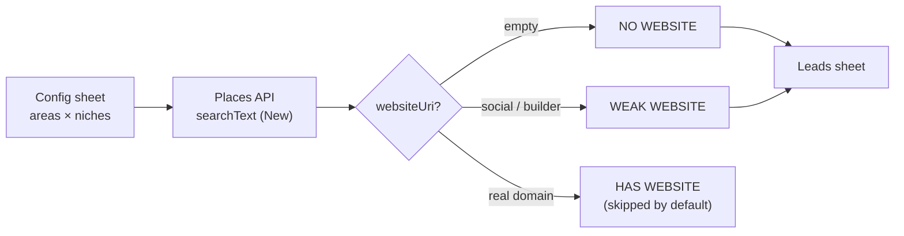

# Places Api Lead Finder

> Find local businesses **without a website** and drop them into a Google Sheet — a ready-to-call lead list for web-design / digitalization sales, built on the official **Google Places API (New)**.
>
> 🇪🇸 Encuentra negocios locales **sin página web** y vuélcalos en una Google Sheet — una lista de leads lista para llamar, sobre la **Google Places API (New)** oficial. *(Versión en español al final.)*

---

## What it does

Given a list of **areas** (towns/cities) and **niche keywords** (e.g. `electricista`, `chapa y pintura`), the script queries the Places API, reads each place's `websiteUri`, and keeps only the businesses that have **no website** or a **weak** one (a Facebook/Instagram page, a `business.site`, a free site-builder URL…). Results land in a filterable sheet with name, address, phone and a Google Maps link.

It runs entirely inside a Google Sheet via Apps Script — no server, no local setup.

## Why it's useful

Local trades and shops with no real web presence are the warmest possible leads for anyone selling websites or digitalization. Google Maps shows these businesses but offers **no "has no website" filter** — you'd check each listing by hand. This automates exactly that check (`websiteUri` present or not) and the classification around it.

## How it works

The field mask requests contact fields (`websiteUri`, `nationalPhoneNumber`), which is what makes a single call return everything needed to qualify a lead. Pagination (`nextPageToken`) pulls up to 60 results per query; re-runs dedupe by `Place ID`.

## Output

| Area | Niche | Name | Phone | Website status | Website | Place ID |
|------|-------|------|-------|----------------|---------|----------|
| Cardedeu | electricista | Instal·lacions Demo SL | 93 000 00 00 | `NO WEBSITE` | | ChIJ… |
| Llinars del Vallès | perruqueria | Perruqueria Exemple | 93 111 11 11 | `WEAK WEBSITE` | facebook.com/exemple | ChIJ… |

*(Placeholder rows.)* Full columns: `Area · Niche · Name · Address · Phone · Website status · Website · Type · Google Maps · Place ID · Fetched on`.

## Cost

Uses the **Text Search Enterprise** SKU: **1,000 free calls/month**. Billing is **per request, not per result**, and each request returns up to 20 places — so a full sweep of a few towns (~100–150 calls) uses ~12% of the free tier. In practice: **~$0/month**. See the [Google Maps Platform pricing](https://developers.google.com/maps/billing-and-pricing/pricing). Cap the SKU quota in Cloud Console to guarantee no charges.

## Quick start

1. Enable **Places API (New)** on a Google Cloud project and create an API key.
2. Create a Google Sheet → **Extensions → Apps Script** → paste [`src/Code.gs`](src/Code.gs).
3. Set `API_KEY` at the top of the script.
4. Reload the sheet → menu **▶ Lead Finder → 1. Set up sheet**, then **2. Find leads**.

Full walkthrough (EN/ES): [`docs/INSTALL.md`](docs/INSTALL.md).

## Configuration

| Constant | Default | Purpose |
|----------|---------|---------|
| `API_KEY` | — | Your Places API (New) key |
| `LANGUAGE` | `'ca'` | Result language (BCP-47) |
| `REGION` | `'ES'` | Result region bias (CLDR) |
| `MAX_PAGES` | `3` | Pages per query (≤3; 20 results each) |
| `DELAY_MS` | `1200` | Pause between calls (per-minute quota) |
| `INCLUDE_BUSINESSES_WITH_WEBSITE` | `false` | Also export businesses that already have a real site |

Areas and niche keywords live in the **Config** tab, so you change targets without touching code. See [`examples/config.sample.md`](examples/config.sample.md).

## Legal / ToS

This is **not a scraper** — it's the official API, the channel Google provides for this data. Note the Maps Platform Terms: most Places content shouldn't be cached beyond **30 days** (the `Place ID` is exempt and may be stored long-term). Use the list as a working prospecting file and refresh it; don't build a permanent resold database.

## Roadmap

- [x] Dedupe across runs (by Place ID)
- [x] Weak-website detection (social / site-builder URLs)
- [ ] `clasp` support to push the script from local
- [ ] One-click CSV export
- [ ] Time-driven trigger for scheduled sweeps
- [ ] Locale-aware menu and column labels

## License

[MIT](LICENSE) © Antonio Rico

---

🇪🇸 <strong>Versión en español</strong>

 

### Qué hace

A partir de una lista de **zonas** (municipios) y **palabras clave de nicho** (p. ej. `electricista`, `chapa y pintura`), el script consulta la Places API, lee el campo `websiteUri` de cada negocio y se queda solo con los que **no tienen web** o tienen una **web débil** (una página de Facebook/Instagram, un `business.site`, una URL de constructor gratuito…). Los resultados caen en una hoja filtrable con nombre, dirección, teléfono y enlace a Google Maps. Funciona dentro de una Google Sheet con Apps Script: sin servidor ni instalaciones.

### Por qué es útil

Los gremios y comercios locales sin presencia web son los leads más calientes para quien vende webs o digitalización. Google Maps muestra esos negocios pero **no ofrece un filtro de "sin web"** — habría que revisar ficha por ficha. Esto automatiza justo esa comprobación (`websiteUri` presente o no) y su clasificación.

### Coste

Usa el SKU **Text Search Enterprise**: **1.000 llamadas gratis/mes**. Se factura **por petición, no por resultado**, y cada petición devuelve hasta 20 negocios — así que un barrido completo de varios municipios (~100–150 llamadas) usa ~12% de la cuota gratuita. En la práctica: **~0 €/mes**. Limita la cuota del SKU en Cloud Console para blindar el 0 €.

### Inicio rápido

1. Activa **Places API (New)** en un proyecto de Google Cloud y crea una API key.
2. Crea una Google Sheet → **Extensiones → Apps Script** → pega [`src/Code.gs`](src/Code.gs).
3. Pon tu `API_KEY` arriba del script.
4. Recarga la hoja → menú **▶ Lead Finder → 1. Set up sheet**, luego **2. Find leads**.

Guía completa: [`docs/INSTALL.md`](docs/INSTALL.md).

### Legal / TOS

**No es scraping**: es la API oficial, el canal que Google ofrece para estos datos. Ojo a los Términos: el contenido de Places no debe cachearse más de **30 días** (el `Place ID` está exento). Usa la lista como fichero de prospección y refréscala; no construyas una base de datos permanente para revender.

